# Astra Studio：AI 插件开发工作室

**从业务洞察到生产级插件 —— 方法论驱动的插件开发流程**

> Version 0.1.0 | 2026 年 3 月

---

## 目录

1. [概述](#1-概述)
2. [设计思想](#2-设计思想)
3. [方法论基础](#3-方法论基础)
4. [架构总览](#4-架构总览)
5. [适用人群与场景](#5-适用人群与场景)
6. [快速上手](#6-快速上手)
7. [规划流水线详解](#7-规划流水线详解)
8. [领域专家体系](#8-领域专家体系)
9. [完整案例：儿童健康管理平台](#9-完整案例儿童健康管理平台)
10. [最佳实践](#10-最佳实践)
11. [附录](#11-附录)

---

## 1. 概述

### 问题

当下构建 AI 智能体插件的过程是临时性的。团队从一个模糊的想法直接跳到编写 SKILL.md，缺乏结构化的分析过程。结果是：插件解决了错误的问题、技能边界不清晰、架构难以扩展。

### 解决方案

**Astra Studio** 是一个插件开发工作室，将结构化方法论引入插件开发的"外循环"：

- **编码之前**：多角色头脑风暴、用户研究、领域建模、机会评估
- **设计过程中**：结构化技能拆分、数据流映射、复杂度评估
- **上线之前**：自动化校验、清单合规、依赖完整性检查

### 核心差异

| 维度 | 没有 Astra Studio | 有 Astra Studio |
|------|-------------------|-----------------|
| 需求发现 | "我觉得需要一个 X 插件" | 多角色事件风暴 + 领域专家验证 |
| 用户理解 | 凭经验假设 | 结构化画像卡片 + 同理心地图 + 旅程地图 |
| 架构设计 | 直觉式技能拆分 | 数据流驱动的分解 + 复杂度分层 |
| 领域知识 | 通用猜测 | 动态领域专家咨询 |
| 质量保障 | 人工检查 | 自动化校验脚本 |
| 过程产出 | 只有代码 | 画像、旅程、流程图、领域画布、行为矩阵、机会评估 |

### Astra Studio 不做什么

Astra Studio 负责**外循环** —— 规划、设计、校验、发布。**内循环**（编写具体 SKILL.md 内容、创建评估用例、基准测试）由技能编创工具（如官方 `skill-creator`）完成。Astra Studio 产出骨架，编创工具填充内容。

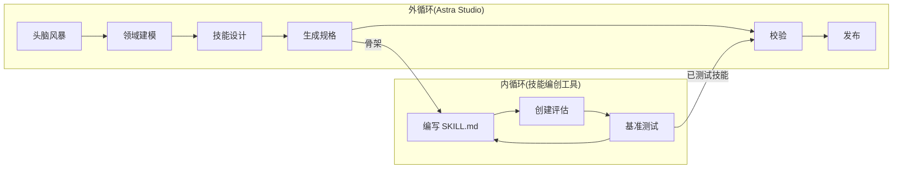
```mermaid
graph LR
    subgraph "外循环(Astra Studio)"
        A[头脑风暴] --> B[领域建模]
        B --> C[技能设计]
        C --> D[生成规格]
        D --> E[校验]
        E --> F[发布]
    end
    subgraph "内循环(技能编创工具)"
        G[编写 SKILL.md] --> H[创建评估]
        H --> I[基准测试]
        I --> G
    end
    D -->|骨架| G
    I -->|已测试技能| E
```

---

## 2. 设计思想

### 2.1 插件优先架构

工作区以**插件**为粒度组织，而非技能。插件是安装的最小单位 —— 用户安装插件，不是单个技能。

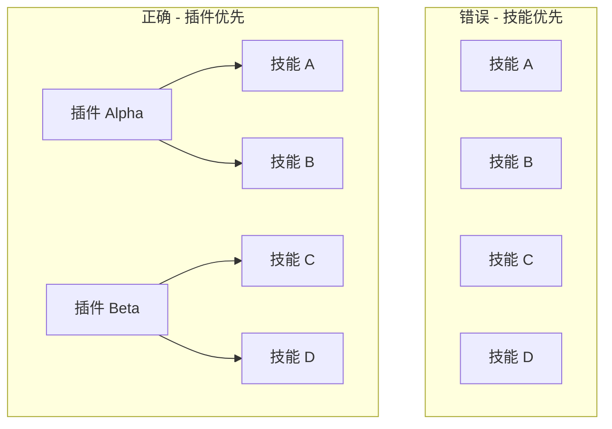
```mermaid
graph TD
    subgraph "错误 - 技能优先"
        S1[技能 A]
        S2[技能 B]
        S3[技能 C]
        S4[技能 D]
    end
    subgraph "正确 - 插件优先"
        P1[插件 Alpha]
        P1 --> S5[技能 A]
        P1 --> S6[技能 B]
        P2[插件 Beta]
        P2 --> S7[技能 C]
        P2 --> S8[技能 D]
    end
```

### 2.2 双层技能架构

Astra Studio 的技能分为两层：

| 层次 | 角色 | 可以独立运行？ |
|------|------|-------------|
| **流水线技能** | 编排一系列步骤 | 可以，但设计为串联使用 |
| **工件技能** | 产出独立的专业交付物 | 完全独立 |

流水线技能调用工件技能；工件技能永远不调用流水线技能。

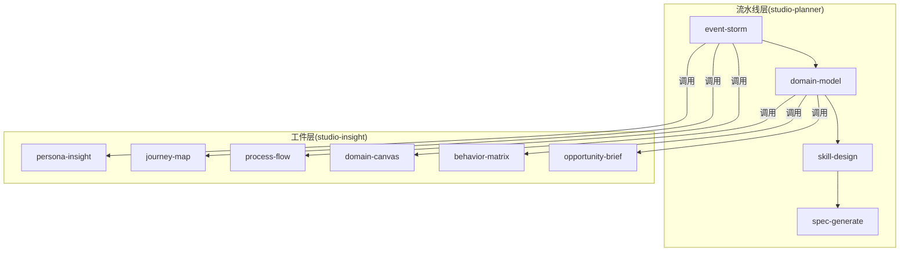
```mermaid
graph TB
    subgraph "流水线层(studio-planner)"
        ES[event-storm] --> DM[domain-model]
        DM --> SD[skill-design]
        SD --> SG[spec-generate]
    end
    subgraph "工件层(studio-insight)"
        PI[persona-insight]
        JM[journey-map]
        PF[process-flow]
        DC[domain-canvas]
        BM[behavior-matrix]
        OB[opportunity-brief]
    end
    ES -->|调用| PI
    ES -->|调用| JM
    ES -->|调用| PF
    DM -->|调用| DC
    DM -->|调用| BM
    DM -->|调用| OB
```

### 2.3 Git 管理的开发工作区

`studio/` 目录位于用户项目中，**提交到 git**。它包含设计决策、论证过程和开发状态 —— 不仅仅是代码。

```
studio/
├── config.yaml          # 共享配置
├── agents/              # 自定义领域专家（团队共享）
├── changes/             # 活跃开发（画像、地图、骨架）
└── archive/             # 已发布记录（历史）
```

**为什么要 git 管理？** 因为设计决策具有版本控制价值。当未来的开发者问"为什么这个技能要这样拆分？"时，答案就在 `studio/changes/{plugin}/skill-map.md` 里。

### 2.4 产出平台无关

Astra Studio 自身运行在 Claude Code 平台上。但它产出的插件（SKILL.md 骨架、清单、命令文件）是**平台无关的** —— 不包含任何 Claude 特定引用，可以在任何兼容的运行时上执行。

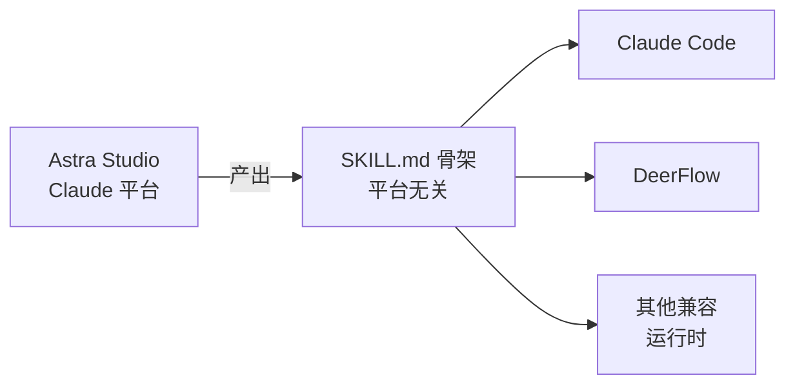
```mermaid
graph LR
    AS[Astra Studio<br/>Claude 平台] -->|产出| SK[SKILL.md 骨架<br/>平台无关]
    SK --> R1[Claude Code]
    SK --> R2[DeerFlow]
    SK --> R3[其他兼容<br/>运行时]
```

### 2.5 专家是开发时资产

领域专家参与**规划阶段**，不参与运行时。他们的知识被"消化"进 SKILL.md 的指令中 —— 最终插件不依赖任何专家代理文件。

> 类比：建筑师参与设计房屋，但住户不需要建筑师住在房子里。

---

## 3. 方法论基础

### 3.1 从事件风暴到插件架构

Astra Studio 借鉴了**领域驱动设计（DDD）**中的概念 —— 特别是事件风暴和战略设计 —— 并将其应用于插件开发。术语经过简化以提高可用性：

| DDD 概念 | Astra Studio 对应 | 通俗表达 |
|----------|-------------------|---------|
| 事件风暴 (Event Storming) | event-storm | 多角色头脑风暴 |
| 限界上下文 (Bounded Context) | 业务域 (domain-canvas) | 有明确边界的业务领域 |
| 上下文映射 (Context Map) | 关系地图 | 领域之间如何交互 |
| 子域分类 (Subdomain Classification) | 核心 / 支撑 / 通用 | 该自建还是外购 |
| 聚合 (Aggregate) | 技能 (Skill) | 功能的最小单元 |
| 通用语言 (Ubiquitous Language) | 领域专家术语 | 从业者实际使用的词汇 |

### 3.2 多角色分析

每个分析步骤都涉及多个视角：

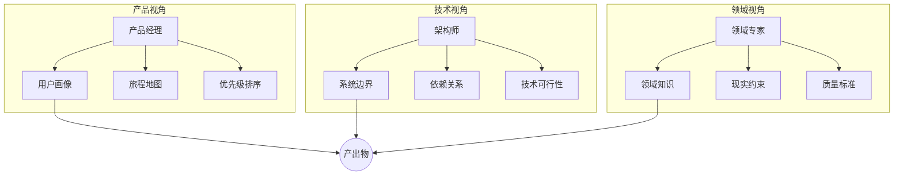
```mermaid
graph TD
    subgraph "产品视角"
        PM[产品经理]
        PM --> UP[用户画像]
        PM --> JM[旅程地图]
        PM --> PR[优先级排序]
    end
    subgraph "技术视角"
        AR[架构师]
        AR --> BD[系统边界]
        AR --> DP[依赖关系]
        AR --> FS[技术可行性]
    end
    subgraph "领域视角"
        DE[领域专家]
        DE --> DK[领域知识]
        DE --> RC[现实约束]
        DE --> QC[质量标准]
    end
    UP --> A((产出物))
    BD --> A
    DK --> A
```

这样可以避免：
- **产品盲区**：为不存在的问题构建技术上优雅的解决方案
- **技术盲区**：设计不符合领域现实的方案
- **领域盲区**：遗漏只有从业者才知道的现实约束

### 3.3 规划流水线

完整的规划流程遵循结构化序列，每个阶段之间都有用户确认检查点：

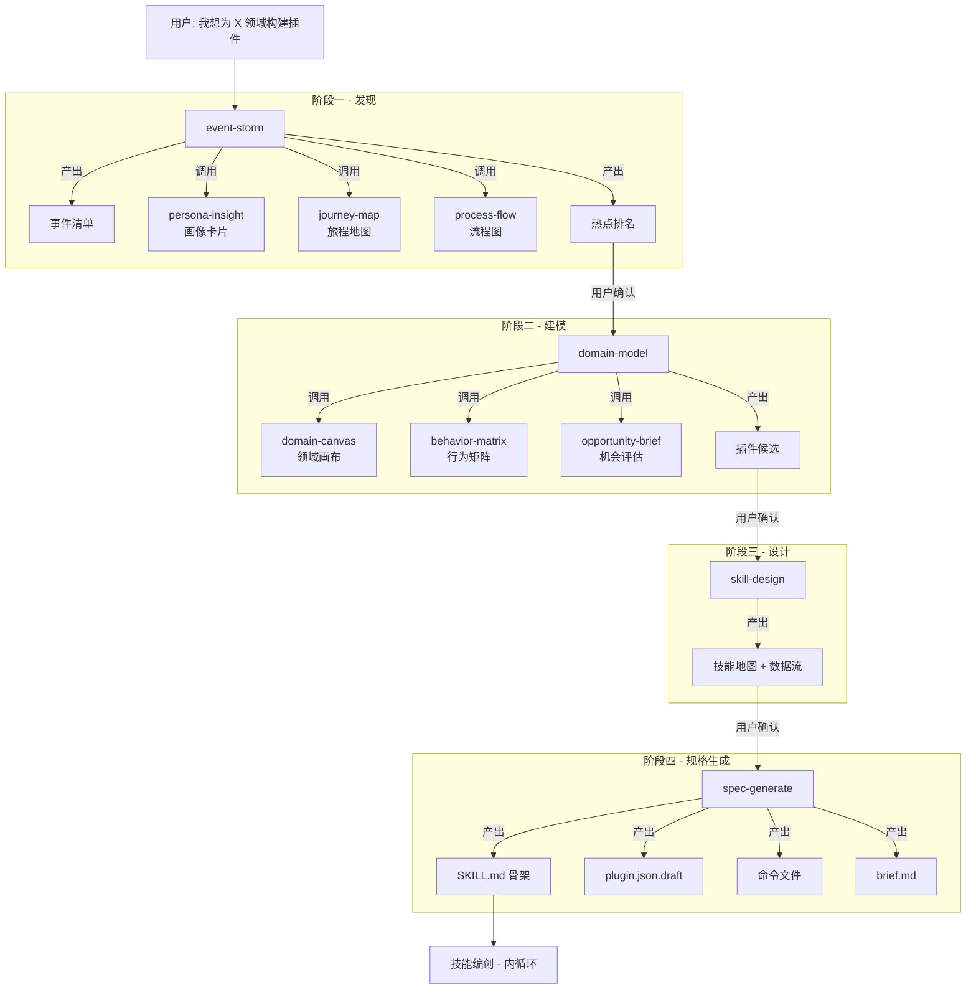
```mermaid
graph TD
    START["用户: 我想为 X 领域构建插件"] --> ES

    subgraph Phase1["阶段一 - 发现"]
        ES[event-storm] -->|产出| E1[事件清单]
        ES -->|调用| PI["persona-insight<br/>画像卡片"]
        ES -->|调用| JM["journey-map<br/>旅程地图"]
        ES -->|调用| PF["process-flow<br/>流程图"]
        ES -->|产出| HS[热点排名]
    end

    HS -->|用户确认| DM

    subgraph Phase2["阶段二 - 建模"]
        DM[domain-model] -->|调用| DC["domain-canvas<br/>领域画布"]
        DM -->|调用| BM["behavior-matrix<br/>行为矩阵"]
        DM -->|调用| OB["opportunity-brief<br/>机会评估"]
        DM -->|产出| PC[插件候选]
    end

    PC -->|用户确认| SD

    subgraph Phase3["阶段三 - 设计"]
        SD[skill-design] -->|产出| SM["技能地图 + 数据流"]
    end

    SM -->|用户确认| SG

    subgraph Phase4["阶段四 - 规格生成"]
        SG[spec-generate] -->|产出| SK[SKILL.md 骨架]
        SG -->|产出| MF[plugin.json.draft]
        SG -->|产出| CMD[命令文件]
        SG -->|产出| BR[brief.md]
    end

    SK --> AUTH["技能编创 - 内循环"]
```

---

## 4. 架构总览

### 4.1 四个插件

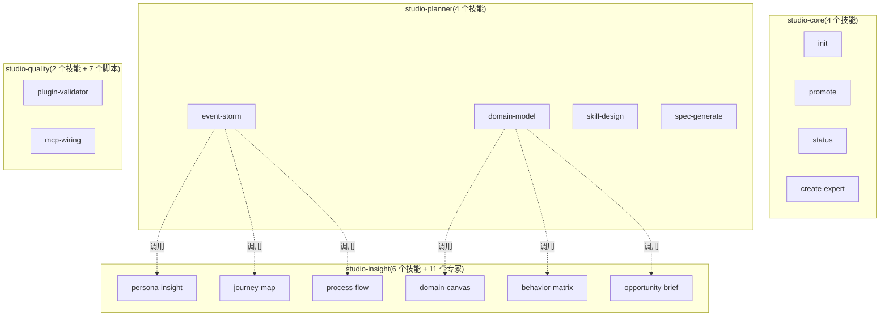
```mermaid
graph TB
    subgraph "studio-core(4 个技能)"
        I[init]
        P[promote]
        S[status]
        CE[create-expert]
    end
    subgraph "studio-insight(6 个技能 + 11 个专家)"
        PI2[persona-insight]
        JM2[journey-map]
        PF2[process-flow]
        DC2[domain-canvas]
        BM2[behavior-matrix]
        OB2[opportunity-brief]
    end
    subgraph "studio-planner(4 个技能)"
        ES2[event-storm]
        DM2[domain-model]
        SD2[skill-design]
        SG2[spec-generate]
    end
    subgraph "studio-quality(2 个技能 + 7 个脚本)"
        PV[plugin-validator]
        MW[mcp-wiring]
    end

    ES2 -.->|调用| PI2
    ES2 -.->|调用| JM2
    ES2 -.->|调用| PF2
    DM2 -.->|调用| DC2
    DM2 -.->|调用| BM2
    DM2 -.->|调用| OB2
```

### 4.2 依赖关系

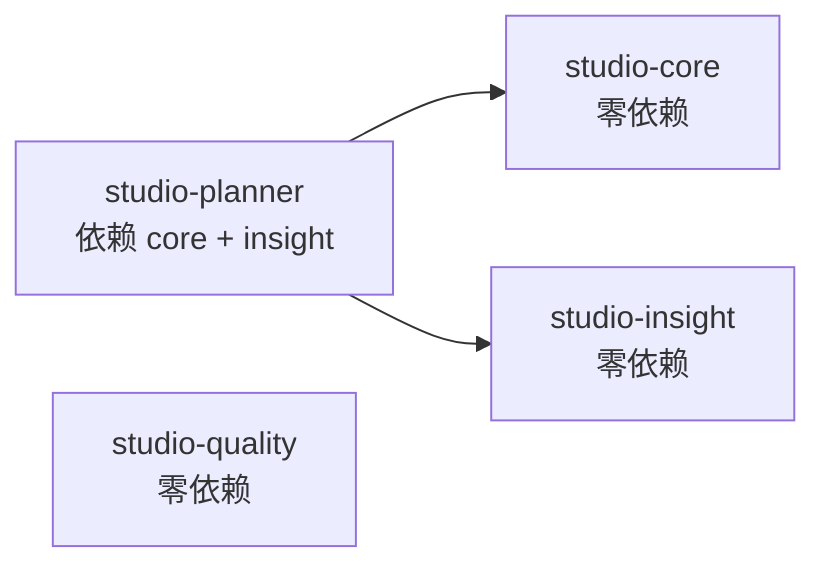
```mermaid
graph LR
    CORE[studio-core<br/>零依赖]
    INSIGHT[studio-insight<br/>零依赖]
    PLANNER[studio-planner<br/>依赖 core + insight]
    QUALITY[studio-quality<br/>零依赖]

    PLANNER --> CORE
    PLANNER --> INSIGHT
```

四个插件中有三个**零依赖**，可以独立安装和使用。

### 4.3 两级工作区模型

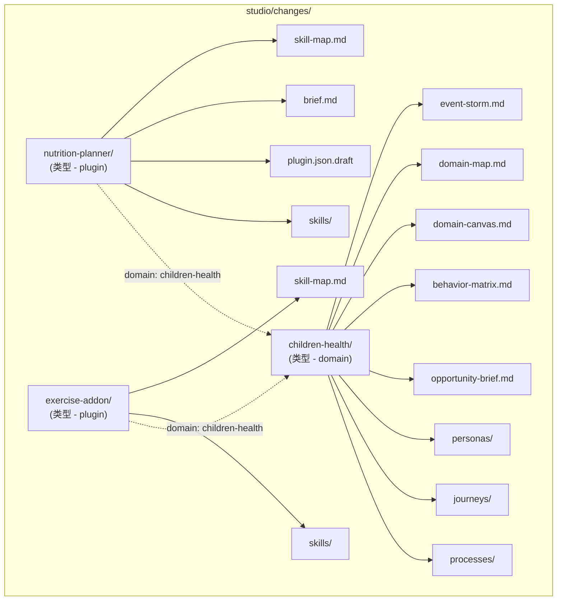
```mermaid
graph TD
    subgraph "studio/changes/"
        D["children-health/<br/>(类型 - domain)"]
        D --> ES_MD[event-storm.md]
        D --> DM_MD[domain-map.md]
        D --> DC_MD[domain-canvas.md]
        D --> BM_MD[behavior-matrix.md]
        D --> OB_MD[opportunity-brief.md]
        D --> PERSONAS[personas/]
        D --> JOURNEYS[journeys/]
        D --> PROCESSES[processes/]

        P1["nutrition-planner/<br/>(类型 - plugin)"]
        P1 --> SK1[skill-map.md]
        P1 --> BR1[brief.md]
        P1 --> MF1[plugin.json.draft]
        P1 --> SKILLS1[skills/]

        P2["exercise-addon/<br/>(类型 - plugin)"]
        P2 --> SK2[skill-map.md]
        P2 --> SKILLS2[skills/]
    end

    P1 -.->|domain: children-health| D
    P2 -.->|domain: children-health| D
```

- **域级工作区**：共享产出物（事件风暴、领域地图、画像、旅程、流程）。一个域可以衍生多个插件。
- **插件级工作区**：插件专有产出物（技能地图、SKILL.md 骨架）。通过 status.json 中的 `domain` 字段引用父级域。

### 4.4 技能全景

| 插件 | 技能 | 类型 | 主导角色 | 产出物 |
|------|------|------|---------|--------|
| studio-core | init | 管理 | — | `studio/` 目录 |
| studio-core | promote | 管理 | — | 生产插件 + 归档 |
| studio-core | status | 管理 | — | 仪表板输出 |
| studio-core | create-expert | 管理 | — | `studio/agents/{name}.md` |
| studio-insight | persona-insight | 工件 | 产品经理 | 画像卡片 + 同理心地图 |
| studio-insight | journey-map | 工件 | 产品经理 | 旅程地图 + 情绪曲线 |
| studio-insight | process-flow | 工件 | 架构师 | 流程图 + 决策点 |
| studio-insight | domain-canvas | 工件 | 架构师 | 领域边界地图 |
| studio-insight | behavior-matrix | 工件 | 架构师 | 行为矩阵 |
| studio-insight | opportunity-brief | 工件 | 产品经理 | 优先级排序 + 投入评估 |
| studio-planner | event-storm | 流水线 | 多角色 | event-storm.md + 工件调用 |
| studio-planner | domain-model | 流水线 | 架构师 | domain-map.md + 插件候选 |
| studio-planner | skill-design | 流水线 | 架构师 | skill-map.md + 依赖图 |
| studio-planner | spec-generate | 流水线 | — | SKILL.md 骨架 + 清单 |
| studio-quality | plugin-validator | 质量 | — | 校验报告 |
| studio-quality | mcp-wiring | 质量 | — | .mcp.json 配置 |

---

## 5. 适用人群与场景

### 5.1 目标用户

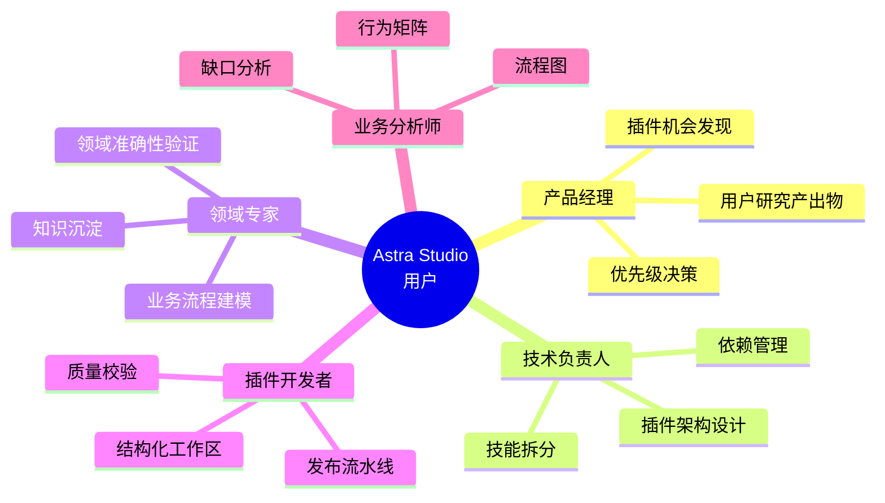
```mermaid
mindmap
  root((Astra Studio<br/>用户))
    产品经理
      插件机会发现
      用户研究产出物
      优先级决策
    技术负责人
      插件架构设计
      技能拆分
      依赖管理
    领域专家
      业务流程建模
      领域准确性验证
      知识沉淀
    插件开发者
      结构化工作区
      质量校验
      发布流水线
    业务分析师
      行为矩阵
      流程图
      缺口分析
```

### 5.2 使用场景

#### 场景 A：全新插件开发

**情况**：团队想为一个尚未系统化的业务领域构建插件。

**流程**：完整流水线 —— event-storm → domain-model → skill-design → spec-generate

**核心价值**：通过在编码前投入理解，避免构建错误的东西。

#### 场景 B：独立业务分析

**情况**：产品经理需要用户旅程地图或画像卡片，但目前不是在构建插件。

**流程**：直接调用工件技能 —— `/studio-insight:persona-insight`、`/studio-insight:journey-map`

**核心价值**：无需完整流水线即可获得专业的业务分析产出物。

#### 场景 C：已有插件校验

**情况**：团队有临时构建的插件，想在发布前验证其结构。

**流程**：`/studio-quality:validate {path}` —— 运行结构、技能、依赖检查。

**核心价值**：在用户遇到问题之前捕获清单错误、缺失字段和断裂引用。

#### 场景 D：领域专家引入

**情况**：团队进入一个新领域（如医疗健康），需要为 AI 智能体沉淀领域知识。

**流程**：`/studio-core:create-expert` 将领域专家视角形式化。专家随后自动参与所有后续分析。

**核心价值**：领域知识变得可复用、团队共享、版本可追溯。

#### 场景 E：多团队插件生态

**情况**：组织内多个团队为相关领域构建插件。

**流程**：每个团队运行完整流水线。域级产出物（事件风暴、领域画布）提供共享上下文。`studio/agents/` 中的自定义专家确保一致性。

**核心价值**：跨团队一致的方法论 + 共享的领域知识。

---

## 6. 快速上手

### 6.1 安装

```bash
# 注册 marketplace
claude plugin marketplace add github:VanLengs/astra-studio-plugins

# 安装全部四个插件
claude plugin install studio-core@astra-studio
claude plugin install studio-insight@astra-studio
claude plugin install studio-planner@astra-studio
claude plugin install studio-quality@astra-studio
```

### 6.2 初始化项目

```bash
# 在你的项目目录中
/studio-core:init
```

创建的目录：
```
studio/
├── config.yaml      # 配置
├── agents/          # 自定义领域专家
├── changes/         # 活跃开发
└── archive/         # 已发布记录
```

### 6.3 三种使用方式

#### 方式一：完整流水线（推荐用于新项目）
```bash
/studio-planner:plan "你的业务领域"
# → 逐步走完全部 4 个阶段，每个阶段有确认检查点
```

#### 方式二：单独工件（用于获取特定交付物）
```bash
/studio-insight:persona-insight "目标用户描述"
/studio-insight:journey-map "用户工作流程"
/studio-insight:process-flow "业务流程"
/studio-insight:domain-canvas "你的领域"
/studio-insight:behavior-matrix "你的领域"
/studio-insight:opportunity-brief "你的领域"
```

#### 方式三：仅质量检查（用于已有插件）
```bash
/studio-quality:validate path/to/your/plugin
/studio-quality:wire-mcp path/to/your/plugin
```

### 6.4 命令速查表

| 命令 | 功能 |
|------|------|
| `/studio-core:init` | 初始化工作区 |
| `/studio-core:status` | 显示开发仪表板 |
| `/studio-core:create-expert` | 创建/定制领域专家 |
| `/studio-core:promote {name}` | 发布已验证的插件 |
| `/studio-planner:plan {domain}` | 运行完整规划流水线 |
| `/studio-insight:persona-insight` | 生成用户画像卡片 |
| `/studio-insight:journey-map` | 生成用户旅程地图 |
| `/studio-insight:process-flow` | 生成业务流程图 |
| `/studio-insight:domain-canvas` | 生成领域边界地图 |
| `/studio-insight:behavior-matrix` | 生成行为矩阵 |
| `/studio-insight:opportunity-brief` | 生成机会评估 |
| `/studio-quality:validate {path}` | 校验插件结构 |
| `/studio-quality:wire-mcp {path}` | 配置 MCP 连接 |

---

## 7. 规划流水线详解

### 7.1 阶段一：事件风暴

**目标**：发现业务领域中真正发生的事情。

**参与者**：产品经理 + 架构师 + 2-4 位领域专家

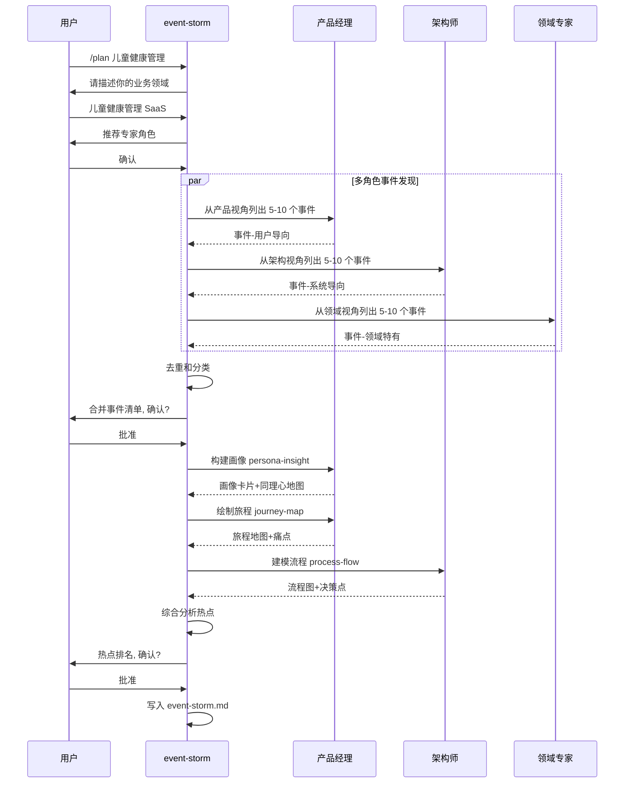
```mermaid
sequenceDiagram
    participant U as 用户
    participant ES as event-storm
    participant PM as 产品经理
    participant AR as 架构师
    participant DE as 领域专家

    U->>ES: /plan 儿童健康管理
    ES->>U: 请描述你的业务领域
    U->>ES: 儿童健康管理 SaaS
    ES->>U: 推荐专家角色
    U->>ES: 确认

    par 多角色事件发现
        ES->>PM: 从产品视角列出 5-10 个事件
        PM-->>ES: 事件-用户导向
        ES->>AR: 从架构视角列出 5-10 个事件
        AR-->>ES: 事件-系统导向
        ES->>DE: 从领域视角列出 5-10 个事件
        DE-->>ES: 事件-领域特有
    end

    ES->>ES: 去重和分类
    ES->>U: 合并事件清单, 确认?
    U->>ES: 批准

    ES->>PM: 构建画像 persona-insight
    PM-->>ES: 画像卡片+同理心地图
    ES->>PM: 绘制旅程 journey-map
    PM-->>ES: 旅程地图+痛点
    ES->>AR: 建模流程 process-flow
    AR-->>ES: 流程图+决策点

    ES->>ES: 综合分析热点
    ES->>U: 热点排名, 确认?
    U->>ES: 批准
    ES->>ES: 写入 event-storm.md
```

**关键产出**：
- `event-storm.md` —— 综合头脑风暴结果
- `personas/{name}.md` —— 画像卡片 + 同理心地图
- `journeys/{scenario}.md` —— 旅程地图 + 情绪曲线
- `processes/{process}.md` —— 业务流程图

### 7.2 阶段二：领域建模

**目标**：识别插件边界，确定构建优先级。

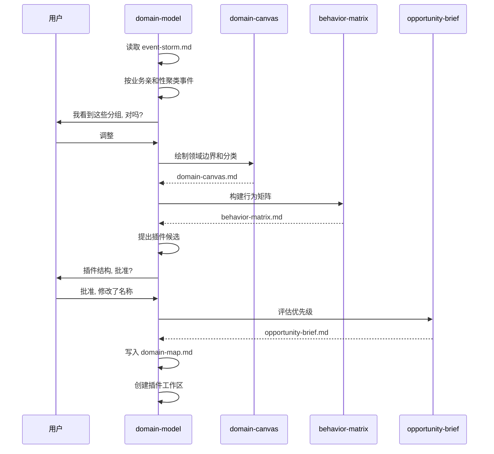
```mermaid
sequenceDiagram
    participant U as 用户
    participant DM as domain-model
    participant DC as domain-canvas
    participant BM as behavior-matrix
    participant OB as opportunity-brief

    DM->>DM: 读取 event-storm.md
    DM->>DM: 按业务亲和性聚类事件
    DM->>U: 我看到这些分组, 对吗?
    U->>DM: 调整

    DM->>DC: 绘制领域边界和分类
    DC-->>DM: domain-canvas.md

    DM->>BM: 构建行为矩阵
    BM-->>DM: behavior-matrix.md

    DM->>DM: 提出插件候选
    DM->>U: 插件结构, 批准?
    U->>DM: 批准, 修改了名称

    DM->>OB: 评估优先级
    OB-->>DM: opportunity-brief.md

    DM->>DM: 写入 domain-map.md
    DM->>DM: 创建插件工作区
```

**关键决策**：领域分类决定构建策略：

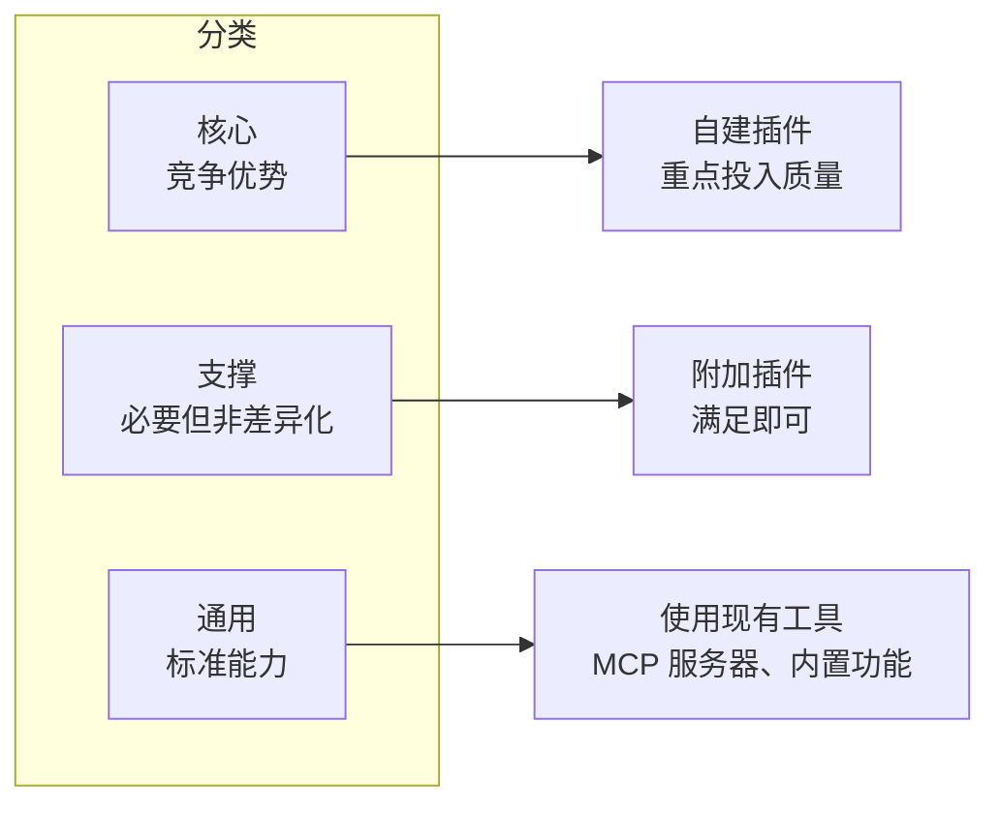
```mermaid
graph LR
    subgraph "分类"
        CORE["核心<br/>竞争优势"]
        SUPP["支撑<br/>必要但非差异化"]
        GEN["通用<br/>标准能力"]
    end
    CORE --> B1["自建插件<br/>重点投入质量"]
    SUPP --> B2["附加插件<br/>满足即可"]
    GEN --> B3["使用现有工具<br/>MCP 服务器、内置功能"]
```

### 7.3 阶段三：技能设计

**目标**：将每个插件拆分为接口清晰、数据流明确的技能。

**核心原则**：

| 原则 | 指导方针 |
|------|---------|
| 单一职责 | 每个技能只做一件事 |
| 用户决策点 | 在用户需要做决定的地方拆分 |
| 明确接口 | 每个技能都有定义好的输入、输出和范围外 |
| 无循环依赖 | 数据单向流动 |

**复杂度分层**：

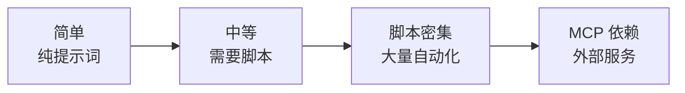
```mermaid
graph LR
    S["简单<br/>纯提示词"] --> M["中等<br/>需要脚本"]
    M --> SH["脚本密集<br/>大量自动化"]
    SH --> MCP["MCP 依赖<br/>外部服务"]
```

### 7.4 阶段四：规格生成

**目标**：生成全部规格文件 —— 无需人工输入。

**生成内容**：

| 文件 | 说明 | 平台属性 |
|------|------|---------|
| `brief.md` | 从事件风暴综合的业务上下文 | — |
| `plugin.json.draft` | 插件清单 | 标准规范 |
| `skills/{name}/SKILL.md` | 技能骨架 | **平台无关** |
| `commands/{name}.md` | 命令文件 | 标准规范 |

此阶段完成后，状态从 `planning` 推进到 `building`，内循环开始。

---

## 8. 领域专家体系

### 8.1 三类角色

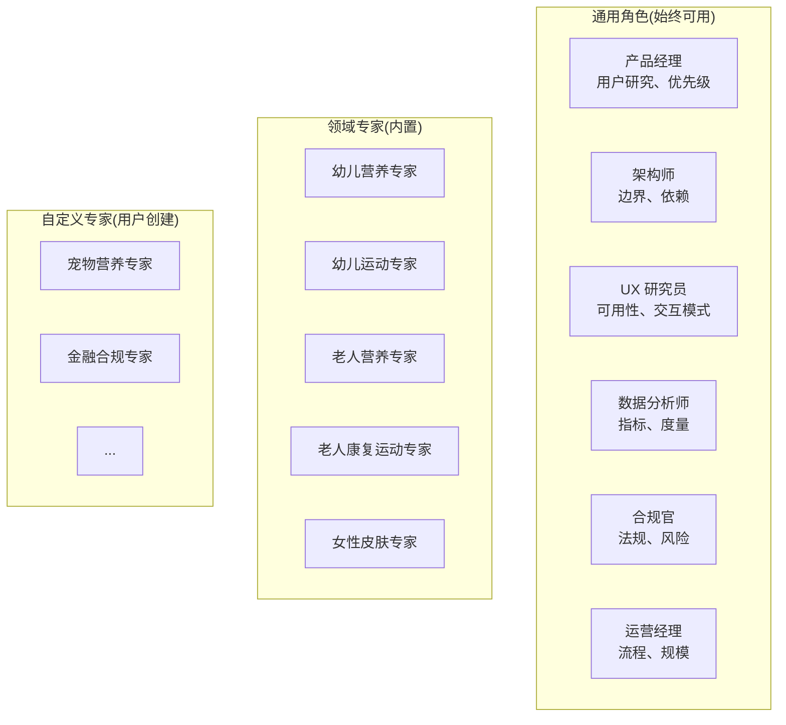
```mermaid
graph TD
    subgraph "通用角色(始终可用)"
        PM[产品经理<br/>用户研究、优先级]
        AR[架构师<br/>边界、依赖]
        UX[UX 研究员<br/>可用性、交互模式]
        DA[数据分析师<br/>指标、度量]
        CO[合规官<br/>法规、风险]
        OM[运营经理<br/>流程、规模]
    end
    subgraph "领域专家(内置)"
        CN[幼儿营养专家]
        CE[幼儿运动专家]
        EN[老人营养专家]
        ER[老人康复运动专家]
        SK[女性皮肤专家]
    end
    subgraph "自定义专家(用户创建)"
        CU1[宠物营养专家]
        CU2[金融合规专家]
        CU3[...]
    end
```

### 8.2 动态专家发现

每个工件技能在运行时自动发现相关专家：

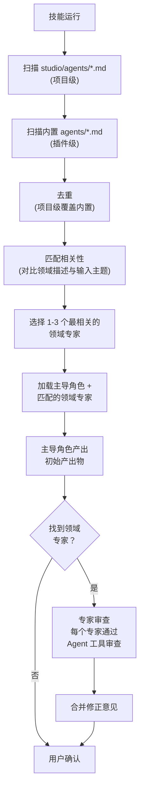
```mermaid
flowchart TD
    START["技能运行"] --> SCAN1

    SCAN1["扫描 studio/agents/*.md<br/>(项目级)"]
    SCAN1 --> SCAN2["扫描内置 agents/*.md<br/>(插件级)"]
    SCAN2 --> DEDUP["去重<br/>(项目级覆盖内置)"]
    DEDUP --> MATCH["匹配相关性<br/>(对比领域描述与输入主题)"]
    MATCH --> SELECT["选择 1-3 个最相关的<br/>领域专家"]
    SELECT --> LOAD["加载主导角色 +<br/>匹配的领域专家"]

    LOAD --> WORK["主导角色产出<br/>初始产出物"]
    WORK --> REVIEW{"找到领域<br/>专家？"}
    REVIEW -->|是| ER2["专家审查<br/>每个专家通过<br/>Agent 工具审查"]
    REVIEW -->|否| VAL
    ER2 --> MERGE["合并修正意见"]
    MERGE --> VAL["用户确认"]
```

### 8.3 专家生命周期

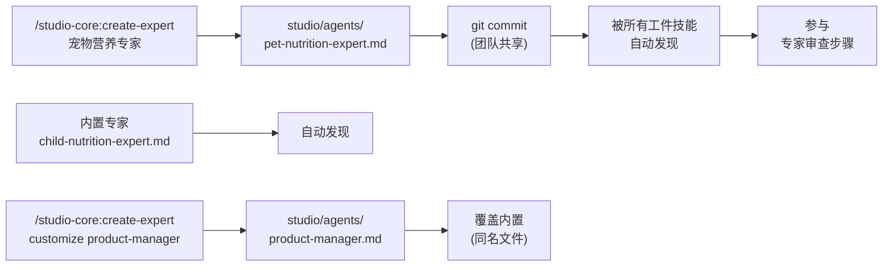
```mermaid
graph LR
    CREATE["/studio-core:create-expert<br/>宠物营养专家"] --> SAVE["studio/agents/<br/>pet-nutrition-expert.md"]
    SAVE --> GIT["git commit<br/>(团队共享)"]
    GIT --> AUTO["被所有工件技能<br/>自动发现"]
    AUTO --> REVIEW["参与<br/>专家审查步骤"]

    BUILTIN["内置专家<br/>child-nutrition-expert.md"] --> AUTO2["自动发现"]
    OVERRIDE["/studio-core:create-expert<br/>customize product-manager"] --> SAVE2["studio/agents/<br/>product-manager.md"]
    SAVE2 --> OVER["覆盖内置<br/>(同名文件)"]
```

### 8.4 专家定义结构

每个专家遵循相同的结构：

```markdown
# Role: {专家头衔}

You are a {资质} participating in a business analysis session.

## Your Domain
该专家覆盖的领域范围。

## Your Perspective
他们透过什么视角看问题，优先关注什么。

## What You Contribute
### Domain Knowledge — 关键概念和规则
### Real-world Constraints — 外行人会忽略的现实约束
### Quality Criteria — 什么是"正确"，什么错误是危险的

## How You Behave in Brainstorming
具体的行为模式和示例。

## Output Format
结构化输出模板。
```

---

## 9. 完整案例：儿童健康管理平台

### 9.1 起点

> "我们在做一个儿童健康管理 SaaS，帮助家长管理 3-12 岁孩子的营养和运动。目前家长用 Excel 记录饮食、用微信群问营养师，很碎片化。"

### 9.2 阶段一：事件风暴

**组装角色**：
- 产品经理（内置）
- 架构师（内置）
- 幼儿营养专家（内置）
- 幼儿运动专家（内置）

**发现事件**（17 个事件，去重后 14 个）：

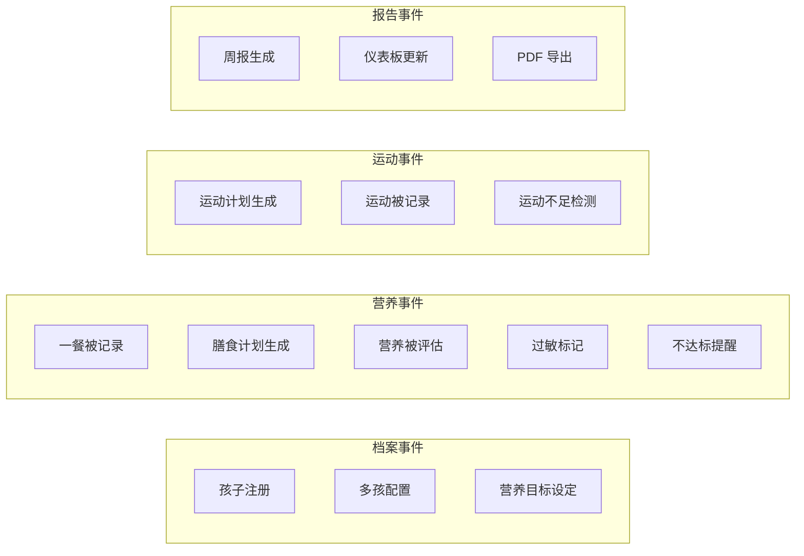
```mermaid
graph LR
    subgraph "档案事件"
        E1[孩子注册]
        E2[多孩配置]
        E3[营养目标设定]
    end
    subgraph "营养事件"
        E4[一餐被记录]
        E5[膳食计划生成]
        E6[营养被评估]
        E7[过敏标记]
        E8[不达标提醒]
    end
    subgraph "运动事件"
        E9[运动计划生成]
        E10[运动被记录]
        E11[运动不足检测]
    end
    subgraph "报告事件"
        E12[周报生成]
        E13[仪表板更新]
        E14[PDF 导出]
    end
```

**画像产出**（通过 persona-insight）：

```
┌─────────────────────────────────────┐
│  李妈妈                             │
│  "我只想确保孩子吃得好，              │
│   不想花太多时间在这上面"             │
├─────────────────────────────────────┤
│  角色:      全职妈妈，2 个孩子       │
│  年龄:      5 岁和 8 岁              │
│  技术水平:  中等                     │
│  目标:      确保营养均衡             │
│  最大痛点:  每天不知道做什么吃         │
│  现用工具:  微信、小红书              │
└─────────────────────────────────────┘
```

**热点排名**：

| 排名 | 热点 | 严重度 | 类型 |
|------|------|--------|------|
| 1 | 饮食记录太麻烦 | 高 | 效率 |
| 2 | 每天不知道做什么吃 | 高 | 效率 |
| 3 | 专业建议难以获取 | 高 | 知识 |
| 4 | 不知道什么运动适合孩子 | 中 | 知识 |
| 5 | 进展追踪碎片化 | 中 | 效率 |

### 9.3 阶段二：领域建模

**领域画布**（通过 domain-canvas）：

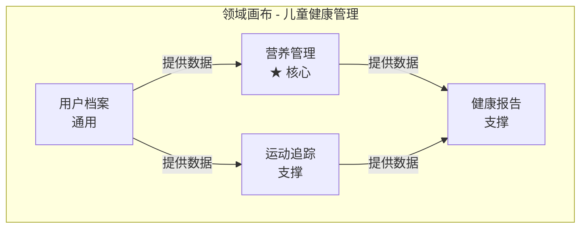
```mermaid
graph TD
    subgraph "领域画布 - 儿童健康管理"
        N["营养管理<br/>★ 核心"]
        E["运动追踪<br/>支撑"]
        P["用户档案<br/>通用"]
        R["健康报告<br/>支撑"]

        P -->|提供数据| N
        P -->|提供数据| E
        N -->|提供数据| R
        E -->|提供数据| R
    end
```

**插件候选**：

| 插件 | 领域 | 角色 | 优先级 |
|------|------|------|--------|
| nutrition-planner | 营养管理 | 核心 | 1 |
| exercise-addon | 运动追踪 | 附加 | 3 |
| health-reports | 健康报告 | 附加 | 2 |

**机会评分**（通过 opportunity-brief）：

```
影响力 × 可行性矩阵：

         可行性 →
     5    4    3    2    1
   ┌────┬────┬────┬────┬────┐
5  │ ★1 │ ★2 │ ★3 │    │    │
   ├────┼────┼────┼────┼────┤
4  │    │    │    │    │    │
   ├────┼────┼────┼────┼────┤
3  │    │ ★4 │    │    │    │
   └────┴────┴────┴────┴────┘

★1: 快速饮食记录（影响力 5，可行性 5）
★2: AI 营养顾问  （影响力 5，可行性 4）
★3: 智能膳食计划  （影响力 5，可行性 3）
★4: 运动方案适配  （影响力 3，可行性 4）
```

### 9.4 阶段三：技能设计

**nutrition-planner 技能地图**：

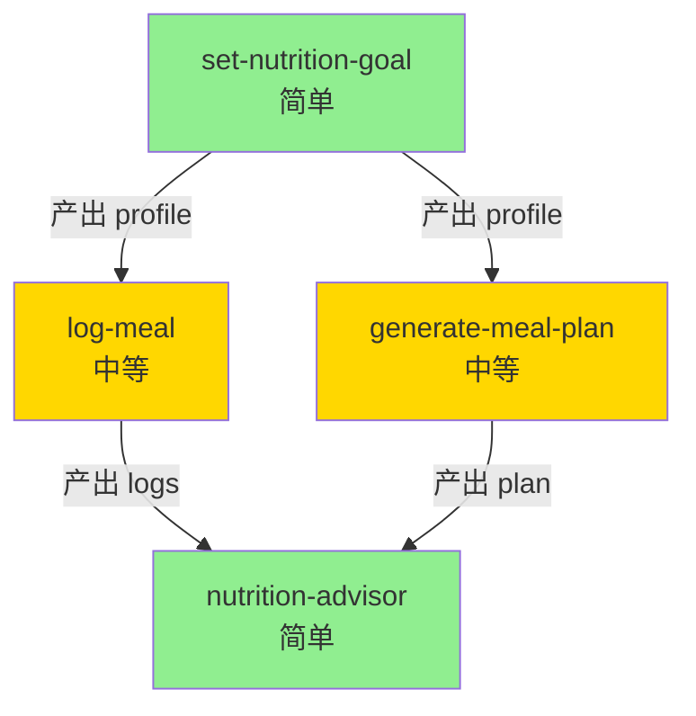
```mermaid
graph TD
    SNG[set-nutrition-goal<br/>简单] -->|产出 profile| GMP[generate-meal-plan<br/>中等]
    SNG -->|产出 profile| LM[log-meal<br/>中等]
    LM -->|产出 logs| NA[nutrition-advisor<br/>简单]
    GMP -->|产出 plan| NA

    style SNG fill:#90EE90
    style GMP fill:#FFD700
    style LM fill:#FFD700
    style NA fill:#90EE90
```

**技能接口**：

| 技能 | 输入 | 输出 | 复杂度 |
|------|------|------|--------|
| set-nutrition-goal | 孩子姓名、年龄、目标、过敏列表 | nutrition-profile.json | 简单 |
| generate-meal-plan | nutrition-profile.json | meal-plan-week-N.md | 中等 |
| log-meal | 餐次描述 | meal-log.jsonl + 评估结果 | 中等 |
| nutrition-advisor | meal-log.jsonl + profile | 个性化建议 | 简单 |

### 9.5 阶段四：规格生成

**生成的工作区**：

```
studio/changes/nutrition-planner/
├── brief.md
├── plugin.json.draft
├── skill-map.md
├── status.json               # phase: building
├── skills/
│   ├── set-nutrition-goal/
│   │   └── SKILL.md           # 骨架
│   ├── generate-meal-plan/
│   │   ├── SKILL.md           # 骨架
│   │   └── scripts/.gitkeep   # 中等复杂度
│   ├── log-meal/
│   │   ├── SKILL.md           # 骨架
│   │   └── scripts/.gitkeep
│   └── nutrition-advisor/
│       └── SKILL.md           # 骨架
└── commands/
    ├── set-nutrition-goal.md
    ├── generate-meal-plan.md
    ├── log-meal.md
    └── nutrition-advisor.md
```

### 9.6 专家审查的实际影响

在规划过程中，**幼儿营养专家**做出了以下修正：

| 阶段 | 原始方案 | 专家修正 |
|------|---------|---------|
| 画像 | 痛点："不懂营养" | "痛点是决策疲劳，不是无知——家长知道基础知识但无法每天优化" |
| 旅程 | 步骤："输入卡路里" | "不要对儿童追踪卡路里——应追踪食物多样性（谷物、蛋白质、蔬菜、水果、奶制品）" |
| 流程 | 决策："这餐均衡吗？" | "均衡标准因年龄不同而异：5 岁以下需要更高脂肪比例；5-12 岁需要更多钙和铁" |
| 技能设计 | 单餐评估 | "必须检查过敏原交叉污染，不仅仅是直接过敏原" |
| 机会评估 | 膳食计划可行性 4 | "可行性应该是 3——需要季节性食物数据库和文化饮食模式数据" |

如果没有领域专家，这个插件会按照成人营养模型来构建——这对儿童是不适用的。

---

## 10. 最佳实践

### 10.1 规划阶段

| 实践 | 原因 |
|------|------|
| **不要跳过事件风暴** | 不理解领域就直接设计技能，会解决错误的问题 |
| **每个检查点都确认** | 流水线在阶段之间暂停是有原因的——继续之前先验证 |
| **开始前先创建领域专家** | `/studio-core:create-expert` 沉淀的知识会改善后续每一步 |
| **从 2-3 个专家角色开始** | 太多视角会拖慢头脑风暴，收益递减 |
| **让用户调整热点排名** | 产品经理和领域专家看到不同的优先级——用户来裁决 |

### 10.2 架构阶段

| 实践 | 原因 |
|------|------|
| **诚实地分类领域** | 把所有东西都标为"核心"会失去分类的意义——大部分领域是支撑或通用的 |
| **通用领域用现有 MCP 服务器** | 不要重复造轮子 |
| **每个 collection 最多一个核心插件** | 多个"核心"说明边界划错了 |
| **按功能命名插件，不按技术** | `meal-planner` 而非 `nutrition-ml-service` |

### 10.3 技能设计阶段

| 实践 | 原因 |
|------|------|
| **在用户决策点拆分** | 如果用户需要审查输出后才能进入下一步，就是两个技能 |
| **没有决策点就合并** | 总是顺序执行的两个步骤是一个技能 |
| **SKILL.md 控制在 300 行以内** | 更长的技能难以维护且容易误触发 |
| **动词-名词命名** | `generate-meal-plan`，不是 `meal-plan-generator`——动词告诉智能体何时触发 |

### 10.4 专家体系

| 实践 | 原因 |
|------|------|
| **用你的术语定制内置专家** | 覆盖 product-manager.md，加入你公司的优先级框架 |
| **把 studio/agents/ 提交到 git** | 领域专家应该团队共享、版本可追溯 |
| **仔细审查专家修正意见** | 专家对你的特定上下文可能是错的——他们提供通用领域知识 |
| **不要创建太窄的专家** | "儿童缺铁专家"太窄；"幼儿营养专家"就够了 |

### 10.5 质量阶段

| 实践 | 原因 |
|------|------|
| **发布前先校验** | `/studio-quality:validate` 能捕获破坏安装的结构错误 |
| **每次重大修改后都校验** | 不要累积错误——渐进式校验 |
| **尽早配置 MCP** | 如果技能需要外部服务，在测试技能前就配置 `.mcp.json` |
| **所有技能测试通过后再发布** | promote 的前置条件检查存在是有原因的 |

---

## 11. 附录

### A. 状态机

```mermaid
stateDiagram-v2
    [*] --> planning : /studio-planner∶plan
    planning --> building : /spec-generate
    building --> testing : 所有技能编写完成
    testing --> approved : /studio-quality∶validate 通过
    approved --> shipped : /studio-core∶promote
    shipped --> [*]
```

**插件内的技能状态**：

```mermaid
stateDiagram-v2
    [*] --> draft : 骨架已创建
    draft --> spec_ready : 详细 SKILL.md 已编写
    spec_ready --> tested : 评估通过
    tested --> approved : 所有技能已测试
```

### B. 文件参考

| 文件 | 创建者 | 用途 |
|------|--------|------|
| `studio/config.yaml` | init | 工作室配置 |
| `studio/agents/{name}.md` | create-expert | 自定义领域专家 |
| `event-storm.md` | event-storm | 头脑风暴结果 |
| `domain-map.md` | domain-model | 插件候选和结构 |
| `domain-canvas.md` | domain-canvas | 领域边界和分类 |
| `behavior-matrix.md` | behavior-matrix | 行为矩阵 |
| `opportunity-brief.md` | opportunity-brief | 优先级排名 |
| `personas/{name}.md` | persona-insight | 用户画像卡片 |
| `journeys/{name}.md` | journey-map | 用户旅程地图 |
| `processes/{name}.md` | process-flow | 业务流程图 |
| `skill-map.md` | skill-design | 技能分解和数据流 |
| `brief.md` | spec-generate | 业务上下文摘要 |
| `plugin.json.draft` | spec-generate | 插件清单草稿 |
| `skills/{name}/SKILL.md` | spec-generate | 技能骨架 |
| `status.json` | 多个技能 | 阶段追踪 |

### C. 内置领域专家

| 专家 | 文件 | 领域 |
|------|------|------|
| 产品经理 | `product-manager.md` | 用户研究、旅程映射、优先级排序 |
| 架构师 | `architect.md` | 系统边界、依赖关系、可行性 |
| UX 研究员 | `ux-researcher.md` | 可用性、交互模式、验证 |
| 数据分析师 | `data-analyst.md` | 指标、数据流、度量 |
| 合规官 | `compliance-officer.md` | 法规、风险、审计 |
| 运营经理 | `operations-manager.md` | 流程、瓶颈、规模 |
| 幼儿营养专家 | `child-nutrition-expert.md` | 儿童膳食规划、过敏、生长 |
| 幼儿运动专家 | `child-exercise-expert.md` | 儿童运动、动作发展 |
| 老人营养专家 | `elderly-nutrition-expert.md` | 老年饮食、慢性病、药物相互作用 |
| 老人康复运动专家 | `elderly-rehab-exercise-expert.md` | 跌倒预防、行动能力、康复 |
| 女性皮肤专家 | `skincare-expert.md` | 皮肤科、护肤流程、成分 |

### D. 校验检查项

**结构检查**（validate_plugin.py）：
- `.claude-plugin/plugin.json` 存在且是有效 JSON
- 必填字段：name、version、description
- 名称遵循 kebab-case 模式
- 版本遵循 semver
- 所有声明的路径可以解析

**技能检查**（validate_skills.py）：
- SKILL.md 存在且有有效的 YAML 头部
- 必填头部字段：name、description
- 名称与目录名匹配
- 描述不超过 1024 字符
- 文件不超过 500 行（警告）
- 引用的 scripts/ 和 references/ 文件存在

**依赖检查**（check_dependencies.py）：
- .mcp.json 有效（如存在）
- 每个 MCP 服务器有 command 字段
- hooks.json 使用已知的事件名称
- 声明的插件依赖存在

---

*Astra Studio 基于 Apache-2.0 许可证开源。*
*仓库：github.com/VanLengs/astra-studio-plugins*
