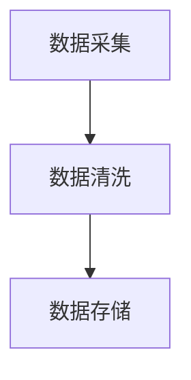

# Export Document

Convert a markdown document to print-ready DOCX and/or PDF format. Handles the full export pipeline: Mermaid diagram rendering to images, pandoc conversion, Chinese government document formatting (fonts, margins, page headers/footers), table beautification, and quality verification. Designed for producing formal Chinese government and institutional documents.

## Inputs

Accept via `$ARGUMENTS`:
- **Source file** (required): Path to the `.md` file to export
- **Output formats** (optional, default `docx+pdf`): `docx`, `pdf`, or `docx+pdf`
- **Blueprint** (optional): Blueprint name to read export settings from. If not specified, auto-detect from document content or use defaults.

Examples:
```
docs/linxi-edutech/智慧校园建设方案.md
docs/linxi-edutech/智慧校园建设方案.md docx
docs/linxi-edutech/智慧校园建设方案.md docx+pdf --blueprint construction-plan
```

## Workflow

1. **Parse arguments** — resolve source file, formats, blueprint
2. **Dependency check** — verify required external tools are installed
3. **Read export settings** — load formatting rules from blueprint or defaults
4. **Mermaid rendering** — extract and render diagrams to images
5. **DOCX generation** — pandoc conversion + python-docx formatting
6. **PDF generation** — Chrome headless or LaTeX pipeline
7. **Cleanup** — remove temporary files
8. **Report** — print export summary

## Step 1: Parse Arguments

### Resolve source file

- Verify the source `.md` file exists
- If path is relative, resolve from current working directory
- Read the file to determine document title and content structure

### Determine output formats

Parse the format argument:
- `docx` → DOCX only
- `pdf` → PDF only
- `docx+pdf` → both (default)

### Resolve blueprint

If `--blueprint` is provided, use that blueprint name.

Otherwise, attempt auto-detection:
1. Check if the markdown file has a frontmatter `blueprint:` field
2. Check if a doc plan exists in the same directory referencing a blueprint
3. If no blueprint found, use built-in defaults

## Step 2: Dependency Check

Run checks via Bash for each required external tool:

```bash
pandoc --version          # Required for MD → DOCX/HTML conversion
mmdc --version            # Required for Mermaid diagram rendering
python3 -c "import docx"  # Required for DOCX formatting
```

For PDF generation, check for Chrome or Chromium:
```bash
# macOS
/Applications/Google\ Chrome.app/Contents/MacOS/Google\ Chrome --version
# Or Chromium
chromium --version
# Or Linux Chrome
google-chrome --version
```

### Missing tool handling

| Tool | Status | Action |
|------|--------|--------|
| pandoc | **Critical** | STOP — `brew install pandoc` (macOS) or `apt install pandoc` (Linux) |
| mmdc | Optional | Skip Mermaid rendering, keep code blocks in output, print warning |
| python-docx | Optional | Skip DOCX beautification, output raw pandoc DOCX |
| Chrome | Optional | Skip PDF generation, output DOCX only |

If pandoc is missing, STOP immediately with install instructions. Pandoc is the only hard requirement.

For optional tools, print a warning and continue with degraded functionality:
```
⚠️ mmdc not found — Mermaid diagrams will appear as code blocks
  Install: npm install -g @mermaid-js/mermaid-cli

⚠️ python-docx not found — DOCX will use default formatting
  Install: pip install python-docx
```

## Step 3: Read Export Settings

### From blueprint

If a blueprint is available, read its `export` section:
```yaml
export:
  page_size: A4
  margins:
    top: 2.54cm
    bottom: 2.54cm
    left: 3.17cm
    right: 3.17cm
  fonts:
    heading1: { name: "方正小标宋简体", size: 22pt }
    heading2: { name: "黑体", size: 16pt }
    heading3: { name: "楷体", size: 15pt }
    body: { name: "仿宋", size: 14pt }
    table: { name: "仿宋", size: 12pt }
  line_spacing: 1.5
  page_header: { text: "{title}", font: "仿宋", size: 9pt, color: gray }
  page_footer: { type: "page_number", position: center }
```

### Default settings

If no blueprint export section is available, use these government document defaults:

```yaml
page_size: A4
margins: { top: 2.54cm, bottom: 2.54cm, left: 3.17cm, right: 3.17cm }
fonts:
  heading1: { name: "方正小标宋简体", size: 22pt }
  heading2: { name: "黑体", size: 16pt }
  heading3: { name: "楷体", size: 15pt }
  body: { name: "仿宋", size: 14pt }
  table: { name: "仿宋", size: 12pt }
line_spacing: 1.5
```

These defaults follow the Chinese government document formatting standard (GB/T 9704).

## Step 4: Mermaid Rendering

Extract and render all Mermaid diagram blocks to PNG images.

### Extraction

Parse the source markdown and find all fenced code blocks with language `mermaid`:
```markdown

```

### Rendering

For each Mermaid block:

1. Write the block content to a temporary `.mmd` file in the document's directory:
   ```
   docs/{domain}/.export-temp/mermaid-{index}.mmd
   ```

2. Create a puppeteer config for Chrome detection:
   ```json
   {
     "executablePath": "/Applications/Google Chrome.app/Contents/MacOS/Google Chrome"
   }
   ```
   Auto-detect the Chrome path based on OS.

3. Render with mermaid-cli:
   ```bash
   mmdc -i mermaid-{index}.mmd -o mermaid-{index}.png -w 1200 -b white -p puppeteer-config.json
   ```

4. If rendering fails for a specific diagram, log the error and skip it (keep the code block).

### Markdown modification

Create a modified copy of the source markdown where each mermaid code block is replaced with an image reference:
```markdown

```

Preserve the figure caption if one exists below the original mermaid block.

## Step 5: DOCX Generation

### Step 5a: Pandoc conversion

Convert the modified markdown (with mermaid blocks replaced by images) to DOCX:

```bash
pandoc {modified_md} \
  -f markdown \
  -t docx \
  --toc \
  --toc-depth=3 \
  -o {output_dir}/{name}.docx
```

This produces a baseline DOCX with correct structure but default styling.

### Step 5b: Python-docx formatting

Apply Chinese document formatting using a Python script. Reference the helper script if available:
```
${CLAUDE_SKILL_DIR}/../../scripts/format_docx.py
```

If the script is not available, implement the formatting logic inline via Bash + Python.

The formatting script performs:

#### Font application

```python
# Apply heading fonts
for paragraph in doc.paragraphs:
    if paragraph.style.name == 'Heading 1':
        run.font.name = '方正小标宋简体'
        run.font.size = Pt(22)
        run._element.rPr.rFonts.set(qn('w:eastAsia'), '方正小标宋简体')
    elif paragraph.style.name == 'Heading 2':
        run.font.name = '黑体'
        run.font.size = Pt(16)
        run._element.rPr.rFonts.set(qn('w:eastAsia'), '黑体')
    # ... heading3 → 楷体 15pt, body → 仿宋 14pt
```

The `w:eastAsia` font mapping is **critical** for Chinese documents — without it, Chinese characters fall back to the default Latin font.

#### Page setup

```python
section = doc.sections[0]
section.page_width = Cm(21.0)    # A4
section.page_height = Cm(29.7)
section.top_margin = Cm(2.54)
section.bottom_margin = Cm(2.54)
section.left_margin = Cm(3.17)
section.right_margin = Cm(3.17)
```

#### Page header and footer

- Header: Document title, 仿宋 9pt, gray, centered
- Footer: Page number, centered, format "— X —"

#### Table formatting

For each table in the document:
- Apply full borders (all cells)
- Header row: bold, centered
- Body text: 仿宋 12pt (小四)
- Cell padding: appropriate for readability
- Auto-fit column widths

#### Line spacing

Set paragraph line spacing to 1.5 lines (or as specified in export settings) for body text. Headings use single spacing with space-before and space-after.

#### Image sizing

For rendered Mermaid images:
- Scale to fit page width minus margins
- Maintain aspect ratio
- Center horizontally

## Step 6: PDF Generation

If PDF format was requested:

### Approach 1: Chrome Headless (preferred)

1. Convert the modified markdown to standalone HTML:
   ```bash
   pandoc {modified_md} -f markdown -t html5 --standalone --toc -o {temp_html}
   ```

2. Inject CSS for Chinese government document styling:
   ```css
   @page {
     size: A4;
     margin: 2.54cm 3.17cm;
   }
   body {
     font-family: "仿宋", "FangSong", serif;
     font-size: 14pt;
     line-height: 1.5;
   }
   h1 { font-family: "方正小标宋简体", "SimSun", serif; font-size: 22pt; }
   h2 { font-family: "黑体", "SimHei", sans-serif; font-size: 16pt; }
   h3 { font-family: "楷体", "KaiTi", serif; font-size: 15pt; }
   table { border-collapse: collapse; width: 100%; }
   td, th { border: 1px solid black; padding: 4px 8px; font-size: 12pt; }
   img { max-width: 100%; display: block; margin: 1em auto; }
   ```

3. Render to PDF with Chrome:
   ```bash
   chrome --headless --disable-gpu \
     --print-to-pdf="{output_dir}/{name}.pdf" \
     --no-pdf-header-footer \
     {temp_html}
   ```

### Approach 2: LaTeX fallback

If Chrome is not available but pandoc has XeLaTeX support:
```bash
pandoc {modified_md} \
  -f markdown \
  --pdf-engine=xelatex \
  -V CJKmainfont="仿宋" \
  -V geometry:margin=2.54cm \
  -o {output_dir}/{name}.pdf
```

### Approach 3: No PDF

If neither Chrome nor LaTeX is available:
- Skip PDF generation
- Print warning: "PDF generation skipped — install Chrome or XeLaTeX"

## Step 7: Cleanup

Remove all temporary files created during export:

```
docs/{domain}/.export-temp/          # Mermaid .mmd and .png files
docs/{domain}/.export-temp/*.html    # Temporary HTML for PDF
docs/{domain}/.export-temp/*.md      # Modified markdown
puppeteer-config.json                # Chrome config (if created)
```

Remove the entire `.export-temp` directory if it was created by this run.

Do NOT remove:
- The source `.md` file
- The output `.docx` and `.pdf` files
- The quality report from `assemble-document`

## Step 8: Report

Print a summary of the export:

```
Export complete:
  📄 DOCX: docs/{domain}/{name}.docx (2.1 MB)
  📄 PDF:  docs/{domain}/{name}.pdf (4.8 MB)

Rendered: 23 Mermaid diagrams
Format: A4, 仿宋 14pt, 1.5x line spacing

Note: If Chinese fonts appear incorrect, ensure 方正小标宋简体, 黑体, 楷体, 仿宋
      are installed on this system.
```

If any degraded features:
```
Export complete (with warnings):
  📄 DOCX: docs/{domain}/{name}.docx (1.8 MB)
  ⚠️ PDF:  skipped (Chrome not found)

Rendered: 0 Mermaid diagrams (mmdc not found — code blocks preserved)
Format: A4, default pandoc styling (python-docx not found)

To get full formatting, install missing tools:
  npm install -g @mermaid-js/mermaid-cli
  pip install python-docx
  Install Google Chrome
```

## Helper Scripts

This skill references helper scripts for complex operations:

| Script | Path | Purpose |
|--------|------|---------|
| `render_mermaid.py` | `${CLAUDE_SKILL_DIR}/../../scripts/render_mermaid.py` | Extract mermaid blocks, render to PNG, produce modified markdown |
| `format_docx.py` | `${CLAUDE_SKILL_DIR}/../../scripts/format_docx.py` | Apply Chinese fonts, margins, headers, table formatting to DOCX |

If helper scripts are not available, the skill implements equivalent logic inline via Bash and Python commands. The scripts are a convenience, not a hard dependency.

## Degradation Strategy

The skill gracefully degrades when optional tools are missing:

```
Missing Tool     → Degraded Behavior
────────────────────────────────────────────────────────────
pandoc missing   → STOP. Pandoc is the only hard dependency.
                   Print install instructions and exit.

mmdc missing     → Skip Mermaid rendering entirely.
                   Mermaid code blocks remain as-is in the output.
                   DOCX/PDF will show raw mermaid syntax.
                   Print warning with install command.

python-docx      → Skip DOCX beautification step.
missing            Output the raw pandoc-generated DOCX.
                   Structure is correct but fonts are default.
                   Print warning with install command.

Chrome missing   → Skip PDF generation.
                   If XeLaTeX available, try LaTeX fallback.
                   If neither available, output DOCX only.
                   Print warning with install options.

Chinese fonts    → DOCX/PDF will render with fallback fonts.
not installed      Document is readable but not visually correct.
                   Print note listing required font names.
```

### Cascading degradation

In the worst case (only pandoc installed), the skill still produces a valid DOCX — just without custom formatting or rendered diagrams. This ensures the export pipeline never completely fails unless pandoc itself is missing.

## Font Requirements

For full government document compliance, the following fonts must be installed on the system:

| Font | Usage | Fallback |
|------|-------|----------|
| 方正小标宋简体 | Heading 1 (document title, chapter headings) | 宋体 (SimSun) |
| 黑体 | Heading 2 (section headings) | SimHei |
| 楷体 | Heading 3 (subsection headings) | KaiTi |
| 仿宋 | Body text, tables | FangSong |

On macOS, these fonts may need to be installed manually. On Windows, 黑体, 楷体, and 仿宋 are typically pre-installed; 方正小标宋简体 requires separate installation.

## Example: Full Export Pipeline

```
User: /studio-docs:export-document docs/linxi-edutech/智慧校园建设方案.md docx+pdf

1. ✅ Source file found (1,247 lines)
2. ✅ Dependencies: pandoc 3.1.9, mmdc 10.6.1, python-docx 1.1.0, Chrome 120
3. ✅ Export settings loaded from blueprint: construction-plan
4. ✅ Mermaid rendering: 23/23 diagrams rendered successfully
5. ✅ DOCX generated: pandoc conversion + python-docx formatting
6. ✅ PDF generated: Chrome headless rendering
7. ✅ Cleanup: removed 47 temp files

Export complete:
  📄 DOCX: docs/linxi-edutech/智慧校园建设方案.docx (2.1 MB)
  📄 PDF:  docs/linxi-edutech/智慧校园建设方案.pdf (4.8 MB)
```
