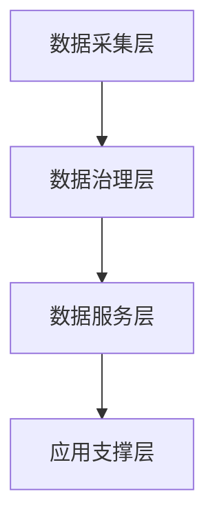

# Write Section

Write a single chapter or section of a document, following the blueprint structure and writer style. This is the **production work unit** of the document generation pipeline — the `generate` command spawns one `write-section` instance (via Agent tool) per chapter or sub-chapter. Each instance runs independently and writes its output to a parts directory for later assembly.

## Input Parameters

Parameters are passed via the Agent prompt when `generate` invokes this skill:

| Parameter | Required | Description |
|-----------|----------|-------------|
| `chapter_id` | Yes | The chapter identifier from the doc plan (e.g., `ch5a`, `ch3`) |
| `doc_plan_path` | Yes | Path to the doc plan YAML (e.g., `studio/changes/linxi-edutech/doc-plan-construction-plan.yaml`) |
| `parts_dir` | Yes | Directory to write the output part file (e.g., `docs/linxi-edutech/.parts/`) |

Example Agent prompt:
```
chapter_id: "ch5a"
doc_plan_path: "studio/changes/linxi-edutech/doc-plan-construction-plan.yaml"
parts_dir: "docs/linxi-edutech/.parts/"
```

## Workflow

1. **Read context** — load the plan, blueprint, and writer
2. **Read artifacts** — gather source material for this chapter
3. **Compose style fingerprint** — extract writing rules
4. **Write content** — produce the chapter markdown
5. **Checkpoint** — write output file to parts directory
6. **Quality self-check** — verify compliance before finishing
7. **Update status** — mark chapter as written or failed in doc plan

## Step 1: Read Context

Load the three primary context sources:

### 1a. Read the Doc Plan

Read the YAML doc plan at the provided `doc_plan_path`:
```
studio/changes/{domain}/doc-plan-{type}.yaml
```

Extract:
- The full chapter list and ordering
- The specific chapter entry matching `chapter_id`
- Blueprint reference (which blueprint this plan was generated from)
- Writer reference (which writer agent to use, if any)
- Global metadata (document title, domain, type)

### 1b. Read the Blueprint

Resolve the blueprint path from the doc plan's `blueprint` field:
- Built-in blueprints: `${CLAUDE_SKILL_DIR}/../../blueprints/{type}.yaml`
- Custom blueprints: `studio/blueprints/{type}.yaml`

Extract from the blueprint:
- Chapter structure definition for this chapter (sections, subsections, guidelines)
- Style rules (numbering convention, heading format)
- Required elements (mermaid diagrams, tables, quantitative data)
- Word count guidance per chapter
- Compliance rules that apply to this chapter

### 1c. Read the Writer Agent

If the doc plan specifies a writer, load the writer agent definition:
```
studio/agents/writers/{writer}.md
```

If no writer agent is specified, the blueprint's `style_rules` section serves as the default style guide.

### 1d. Locate the Chapter Entry

Find the chapter entry in the doc plan matching `chapter_id`. Extract:
- `title`: The chapter heading text
- `artifact_refs`: List of planning artifact paths to reference
- `inherited_refs`: Chapters from previous documents to reference
- `sub_tasks`: If present, this chapter is split into sub-sections
- `required`: Whether this chapter is mandatory
- `word_count`: Target word count range

## Step 2: Read Artifacts

For each `artifact_ref` in the chapter entry:

1. Read the referenced file path
2. If the file is large (>500 lines), use Grep to find sections relevant to this chapter's topic rather than reading the entire file
3. Extract key data: statistics, policy references, technical specifications, organizational structures

For `inherited_refs` (chapters from previous documents in the same domain):
1. Read the referenced chapter from the previous document
2. Extract: structure patterns, terminology used, data points to carry forward
3. Note: inherited content provides context and continuity — do not copy verbatim

Build an **artifact summary** — a condensed view of all source material organized by relevance to this chapter.

## Step 3: Compose Style Fingerprint

The style fingerprint ensures consistent voice across all chapters, even when written by separate Agent instances.

Extract from writer agent definition (or blueprint defaults):

| Dimension | Source | Example |
|-----------|--------|---------|
| **Numbering convention** | Blueprint `style_rules.numbering` | `一、二、三...` or `第一章、第二章...` |
| **Sub-numbering** | Blueprint `style_rules.sub_numbering` | `（一）（二）` or `1.1, 1.2` |
| **Language markers** | Writer agent `## Voice` | Formal government prose, no colloquialisms |
| **Policy citation format** | Writer agent `## Citation Style` | `根据《XXX》（教发〔2023〕X号）` |
| **Paragraph pattern** | Writer agent `## Structure` | Topic sentence → evidence → policy basis → conclusion |
| **Technical terminology** | Writer agent `## Terminology` | Preferred terms and their variants to avoid |

If no writer agent is specified, use blueprint defaults:
- Standard formal Chinese government document style
- Chinese numbering (一、二、三 for chapters, （一）（二）for sections)
- Policy citations in standard format

## Step 4: Write Content

Produce the chapter content following these rules:

### Structure

- Follow the blueprint's chapter structure exactly (sections, subsections, guidelines)
- Each section should have a clear topic sentence
- Use the heading hierarchy from the blueprint (e.g., `#` for chapter, `##` for section, `###` for subsection)

### Content sourcing

- **All factual content must come from planning artifacts** — never invent statistics, policy numbers, budget figures, or organizational details
- If an artifact provides data, cite it naturally in the text
- If data is missing from artifacts, write a placeholder: `[待补充：XXX数据]`

### Required elements

Check the blueprint for required elements per chapter:
- **Mermaid diagrams**: At least 1 per major section if the blueprint requires visual elements. Use `graph TD`, `flowchart LR`, or `gantt` as appropriate
- **Tables**: Use for structured data (budgets, timelines, comparisons, responsibility matrices)
- **Quantitative data**: Include specific numbers from artifacts (enrollment figures, budget amounts, timeline dates)
- **Policy citations**: Reference relevant policy documents with full citation format

### Word count

- Respect the `word_count` range from the blueprint chapter definition
- If the range is `[2000, 3000]`, aim for ~2500 words
- Prefer substance over padding — if the content naturally fits in fewer words, that's acceptable

### Markdown formatting

- Use proper heading levels (never skip levels)
- Use blank lines between paragraphs
- Use fenced code blocks for mermaid diagrams
- Use pipe tables with alignment
- Use ordered/unordered lists where appropriate

## Step 5: Checkpoint Mechanism

Write the completed chapter content to the parts directory:

```
{parts_dir}/{chapter_id}.md
```

For example:
```
docs/linxi-edutech/.parts/ch5a.md
```

The file starts directly with the chapter heading:
```markdown
# 五、建设内容

## （一）统一数据底座

本项目将构建覆盖全校的统一数据底座平台，实现数据的统一采集、存储、治理与共享。
根据《教育信息化2.0行动计划》（教技〔2018〕6号）要求...



...更多内容...
```

### Sub-task checkpointing

If the chapter has `sub_tasks` (very large chapters split into sub-sections):
- Each sub-task writes to `{parts_dir}/{sub_task_id}.md`
- The sub-task ID includes the parent chapter: `ch5a-1`, `ch5a-2`, etc.
- The `assemble-document` skill will merge sub-tasks within a chapter

## Step 6: Quality Self-Check

Before finishing, verify the output against quality criteria:

### Checklist

| Check | Rule | Action if failed |
|-------|------|-----------------|
| **Numbering** | Follows blueprint convention (一/二/三 or 第一章/第二章) | Fix numbering |
| **Mermaid diagrams** | At least 1 per major section (if required by blueprint) | Add diagram |
| **Tables** | Present for data-heavy sections (budgets, timelines) | Add table |
| **Policy citations** | Present if writer requires them | Add citation placeholders |
| **Word count** | Within blueprint's specified range | Expand or trim |
| **Heading hierarchy** | No skipped levels (# → ## → ###, never # → ###) | Fix headings |
| **Placeholders** | All `[待补充]` markers are for genuinely missing data, not laziness | Fill from artifacts |

### Self-check process

1. Read the output file back
2. Count headings, diagrams, tables, citations
3. Estimate word count
4. If any check fails, revise the content and rewrite the file
5. If revision is not possible (e.g., missing artifact data), note in the status update

## Step 7: Update Status

After writing (or failing), update the doc plan YAML:

### On success

Update the chapter's status field:
```yaml
chapters:
  - id: ch5a
    title: "建设内容"
    status: "written"        # ← updated from "pending"
    output: "docs/linxi-edutech/.parts/ch5a.md"
```

### On failure

Set status to `failed` with a reason:
```yaml
chapters:
  - id: ch5a
    title: "建设内容"
    status: "failed"         # ← mark as failed
    error: "Missing artifact: investment-budget.yaml not found"
```

## Output Format

Each part file is pure markdown, starting with the chapter heading:

```markdown
# 五、建设内容

## （一）统一数据底座

本项目将构建覆盖全校的统一数据底座平台...

### 1. 数据采集体系

...内容...

### 2. 数据治理框架

...内容...

## （二）智慧教学平台

...内容...
```

No frontmatter. No metadata headers. Just clean markdown content ready for assembly.

## Fault Tolerance

This skill is designed to be resilient — partial work is always preserved.

```
Failure Scenario        → Recovery Strategy
───────────────────────────────────────────────────────
Agent timeout           → File already written to disk is preserved.
                          On retry, check parts_dir for existing content.
                          If partial content exists, continue from last heading.

Agent 503 / rate limit  → Parts directory retains all previously written files.
                          Retry the failed chapter only — other chapters unaffected.

Artifact not found      → Write chapter with [待补充] placeholders.
                          Set status to "written" with warning flag.
                          assemble-document will include the chapter but note gaps.

Retry still fails       → Set status to "failed" with error reason.
                          assemble-document skips this chapter and lists it
                          in the quality report as requiring manual completion.

Blueprint mismatch      → If chapter_id not found in blueprint, log error
                          and set status to "failed" — do not guess structure.
```

### Retry-safe design

The skill is **idempotent** — running it again for the same `chapter_id` overwrites the previous output file. This means:
- Safe to retry without cleanup
- No duplicate content risk
- The doc plan status is always updated to reflect the latest run
